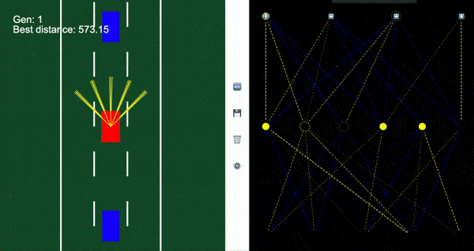

# Car Simulation


This project is inspired by this [video](https://www.youtube.com/watch?v=Rs_rAxEsAvI) that demonstrates how to program a self driving car simulation in plain HTML, CSS, and JavaScript. It features the following modes: manual, lane assist, self driving, and full self driving.



## Table of Contents

1. [Getting started](#getting-started)
2. [Project structure](#project-structure)
3. [Project overview](#project-overview)
4. [New models](#new-models)

## Getting started

This project relies on no external libraries for the actual code but uses Webpack to create static site bundles and Jest for testing to make life easier.

Make sure you have the correct version of NodeJS installed and download the dependencies.

```bash
npm install
```

Use the following command to run the dev server. This will use webpack to compile the Typescript files and you will be able to see the output in your browser.

```bash
npm run dev
```

This command will create a static build.

```bash
npm run build
```

## Project structure

```bash
├── assets                  # Files for the repo
├── css                     # Stylesheets
├── dist                    # Will be created after building
├── public                  # Contains the html for the project
├── src                     # Source files
│   ├── @types              # Type definitions
│   ├── classes             # Actual simulation stuff
│   ├── tracks              # Actual web stuff
│   ├── utils               # Utility functions
│   ├── app.ts              # The good stuff
│
...

# Everything else you probably don't have to worry about
```

## Project overview

App.ts initializes the controller object that controls the simulation and adds some document queries to listen for button presses.

The controller selects which kind of simulation to run, which track to use, and inputs the settings the user sets.

## New models

If you would like to implement a new model, make sure your model can take 1 input for every ray and has 4 outputs, one for up, down, left, and right.

See /src/classes/Models/NeuralNetwork.ts and /src/classes/Controls for an example.

**You may have to comment out the visualizer if you get any errors.**
